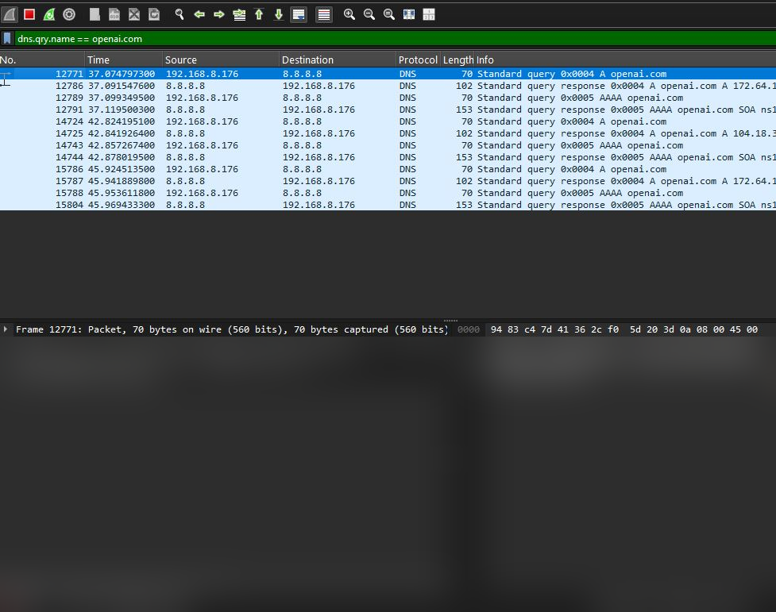
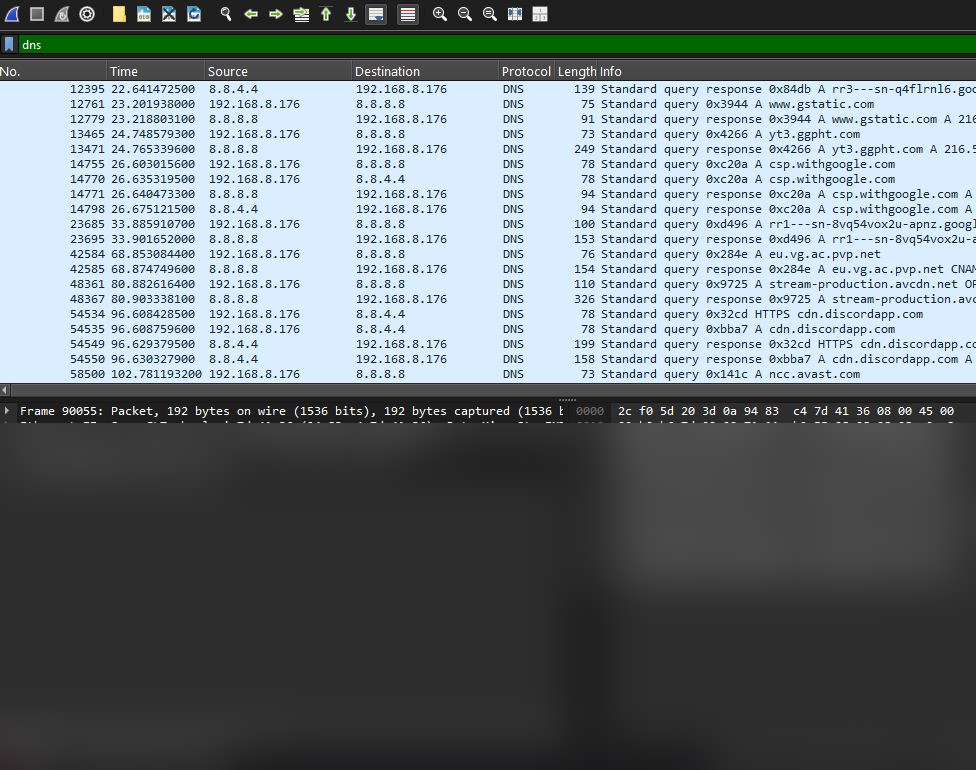
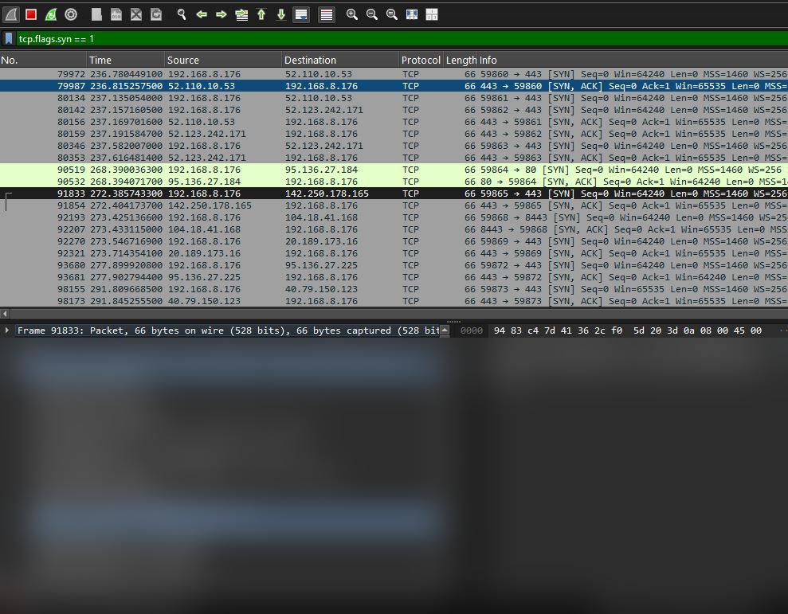
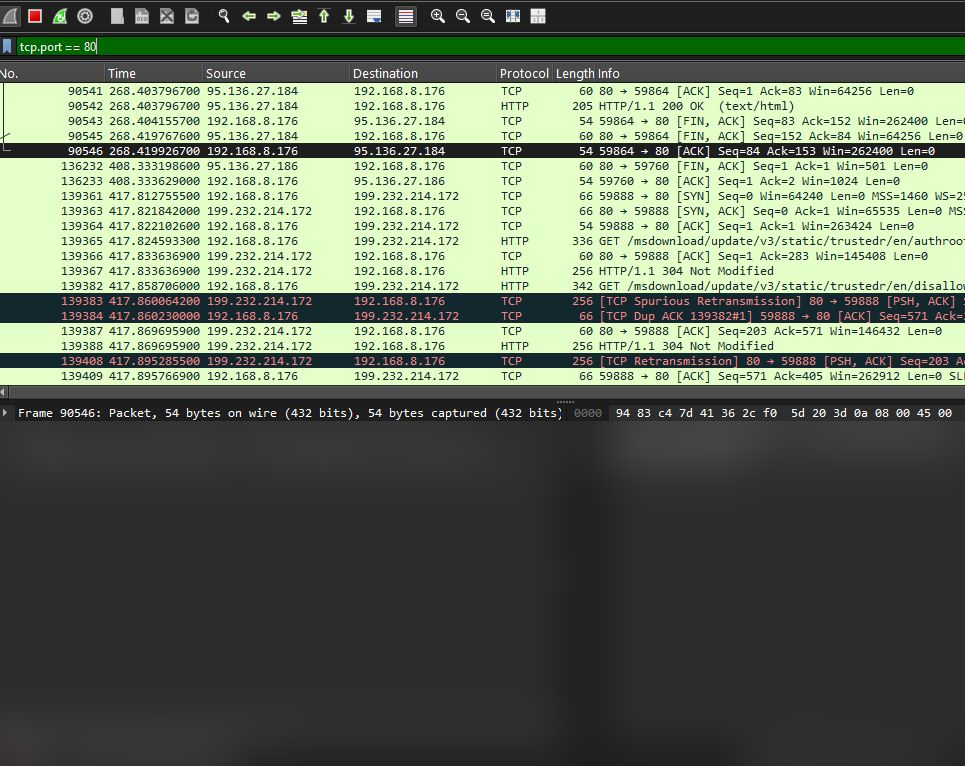
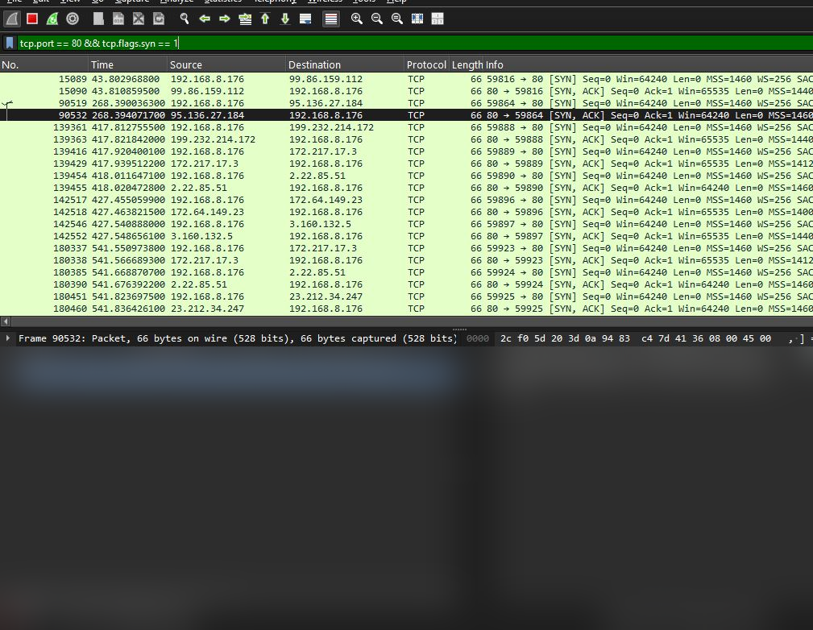
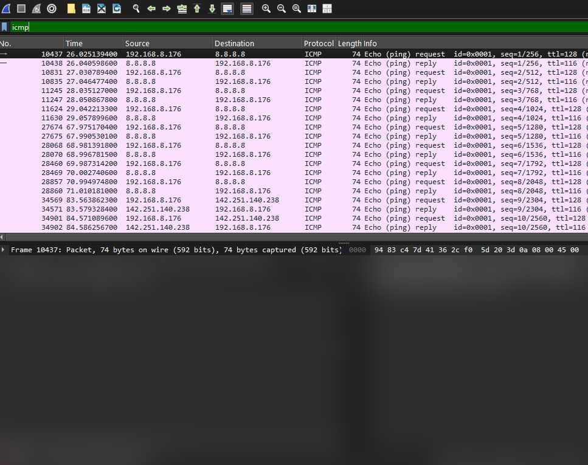
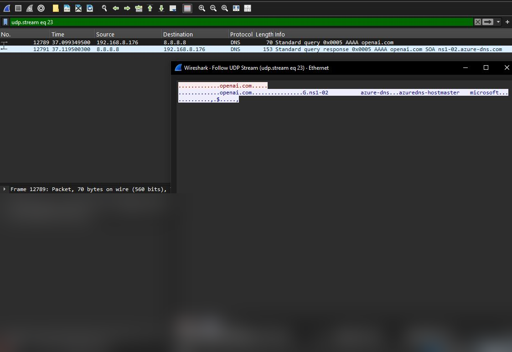
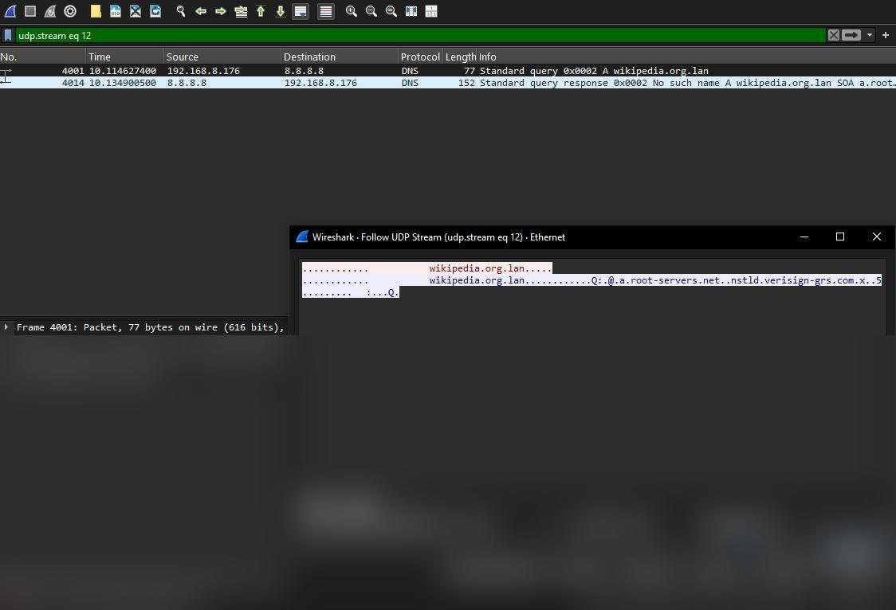

# 🕵️ Wireshark Network Traffic Analysis


---

# 📌 Overview

This project demonstrates **network traffic analysis using Wireshark**.

Captured packets were analyzed to understand how common internet protocols behave in real network traffic.

The investigation focuses on:

- DNS resolution
- TCP connection establishment
- HTTP web traffic
- ICMP network diagnostics
- UDP communication flows

This project highlights **core cybersecurity skills related to packet inspection and network troubleshooting**.

---

# 🧠 Skills Demonstrated

This project demonstrates practical cybersecurity knowledge including:

- packet capture analysis
- network protocol inspection
- TCP/IP fundamentals
- DNS investigation
- HTTP traffic analysis
- identifying security implications of network protocols

---

# 🔬 Protocols Analyzed

| Protocol | Purpose |
|--------|--------|
| DNS | Domain name resolution |
| TCP | Reliable connection-based communication |
| HTTP | Web traffic communication |
| ICMP | Network diagnostics |
| UDP | Connectionless communication |

---

# 📷 Packet Capture Screenshots

Below are examples of captured network traffic analyzed during the investigation.

---

# 🌐 DNS Query Analysis

DNS packets translate domain names into IP addresses.



Security note:

DNS queries are **unencrypted by default**, meaning browsing activity may be visible on the network.

---

# 🌐 DNS Packet Capture

Detailed DNS packet inspection captured in Wireshark.



---

# 🔗 TCP Three-Way Handshake

TCP establishes reliable connections using the **three-way handshake**:

1. SYN  
2. SYN-ACK  
3. ACK  

This ensures both the client and server are ready before data transmission begins.



---

# 🌍 HTTP Traffic Analysis

HTTP traffic captured over **port 80** showing client-server communication.

Example server response:

```
HTTP/1.1 200 OK
Server: Apache
Content-Type: text/html
```



Security note:

HTTP traffic is **plaintext**, meaning attackers could intercept transmitted data.

---

# 🌍 HTTP Traffic Alternate View

Additional HTTP traffic observed during packet inspection.



---

# 📡 ICMP Network Diagnostic Traffic

ICMP packets are used for network diagnostic tools such as **ping**.

Captured traffic includes:

- ICMP Echo Request
- ICMP Echo Reply



These packets help verify network connectivity.

---

# 📨 UDP Stream

UDP communication captured during packet analysis.



Unlike TCP, UDP does not guarantee:

- packet delivery
- packet ordering
- retransmission

This makes UDP faster but less reliable.

---

# 🔁 UDP Flow

Example UDP packet flow captured in Wireshark.



UDP is commonly used by:

- DNS
- streaming services
- real-time communications

---

# 🔐 Security Insights

Several observations relevant to cybersecurity were identified:

• DNS traffic exposes domain queries in plaintext  
• HTTP traffic can reveal sensitive data if not encrypted  
• ICMP traffic can reveal network topology during scanning  
• UDP traffic can be abused in amplification attacks  

Understanding these behaviors is essential for **network defense and threat detection**.

---

# 📂 Project Structure

```
Wireshark-network-analysis
│
├── Screenshots
│   ├── dns-capture.png
│   ├── dns-query.png
│   ├── http-traffic.png
│   ├── http-traffic-alt.png
│   ├── icmp-ping.png
│   ├── tcp-handshake.png
│   ├── udp-flow.jpg
│   └── udp-stream.png
│
├── analysis
│   └── protocol_findings.md
│
├── filters
│   └── wireshark_filters.md
│
└── README.md
```

---

# 🧰 Tools Used

- **Wireshark**
- Packet capture filters
- Display filters
- TCP/IP protocol analysis

---

# 🚀 How to Reproduce the Analysis

1. Install **Wireshark**
2. Start a network capture
3. Generate network traffic (open websites, ping hosts, etc.)
4. Apply display filters such as:

```
dns
tcp
http
icmp
udp
```

5. Inspect packet details and protocol layers.

---

## 📖 Additional Documentation

More detailed technical documentation is available here:

- 📊 [Protocol Findings](analysis/protocol_findings.md)
- 🔎 [Wireshark Filters Reference](filters/wireshark_filters.md)

---

# ⚠️ Disclaimer

This project is intended for **educational purposes only**.

Captured traffic should only be analyzed on networks where you have **authorization**.

---

# ⭐ Portfolio Note

This project demonstrates foundational **cybersecurity and network analysis skills**, including:

- packet inspection
- protocol analysis
- network troubleshooting
- identifying potential security risks

---
